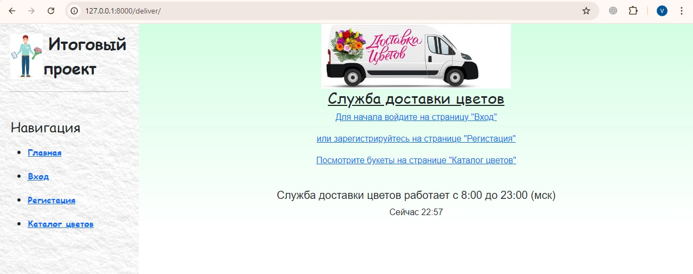
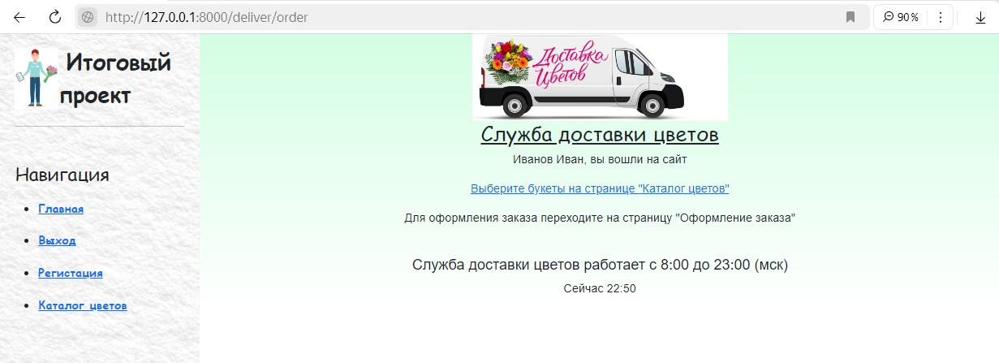
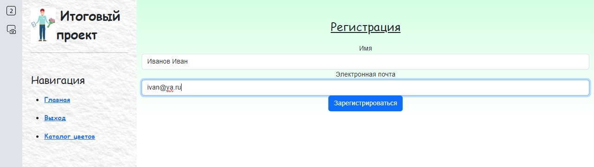
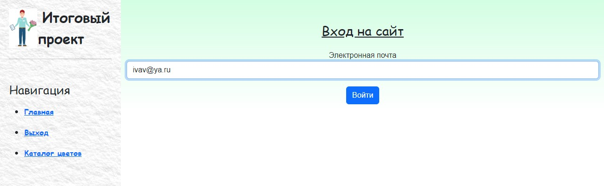
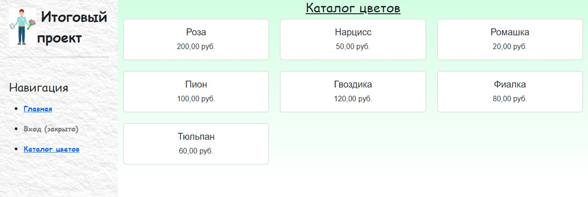
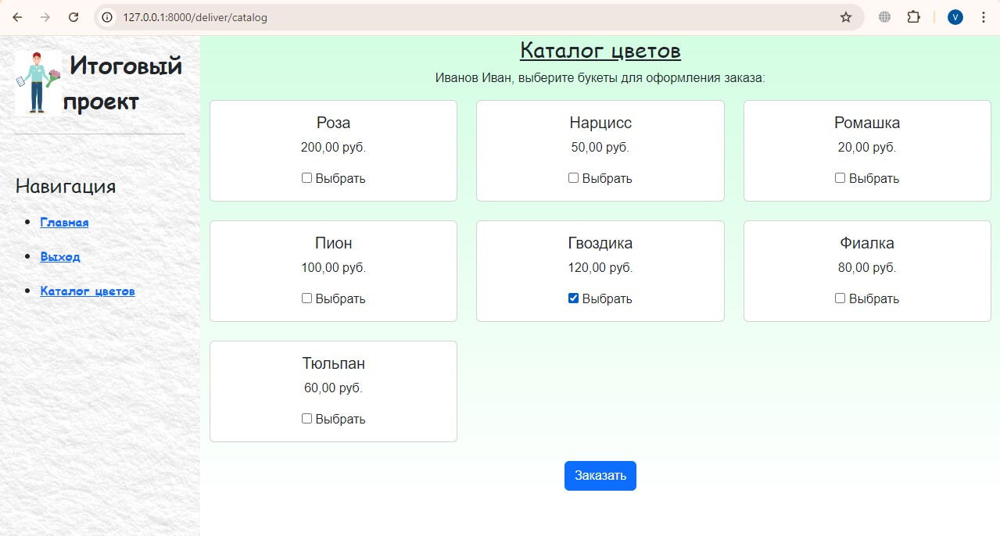
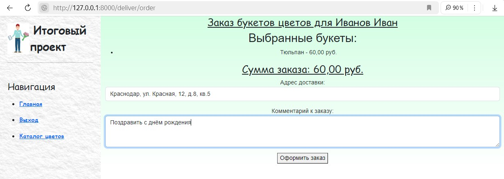

# FlowerDelivery Base 
## Итоговый проект

### Техническое задание:
Сайт с доставкой цветов и получение заказов через Telegram бота
### Цель проекта:
Создание простого веб-сайта для заказа доставки цветов с базовой интеграцией заказов через Telegram бота.
### Общая информация о проекте:
Проект включает разработку простого веб-сайта для заказа цветов и простого Telegram бота для приема заказов.
### Область применения
#### Описание проблемы:
Необходимость упрощенного способа заказа цветов через интернет и мессенджер.
#### Пользователи системы:
Частные лица, заказывающие цветы.
#### Основные ограничения и допущения:
Пользователи должны иметь доступ к интернету и Telegram. Заказы принимаются только в рабочее время.
#### Функциональные требования
- Веб-сайт:
    - Регистрация пользователей.
    - Просмотр каталога цветов.
    - Оформление заказа.
- Telegram бот:
    - Получение заказов с информацией о букетах и доставке.
#### Общая архитектура системы:
- Веб-приложение на Django.
- Серверная часть на Python с использованием Django.
#### Описание подсистем и модулей:
- Модуль регистрации.
- Модуль каталога товаров.
- Модуль оформления заказа.
#### Модель данных
- Таблица пользователей (ID, имя, email).
- Таблица товаров (ID, название, цена).
- Таблица заказов (ID, пользователь, товары).
#### Методы и стратегии тестирования:
- Юнит-тестирование.

## Реализация технического задания
- Проект реализоват под именем [flower_delivery](flower_delivery)
- В проекте реализовано приложение [delivery](flower_delivery/Fdelivery)
- Взаимодействие с Telegram ботом организовано посредством отправления сообщений.
Реализация взаимодействия находится в пакете [telebot](flower_delivery/Fdelivery/Ftelebot).
Там же находится файл config.py с заданным значением токена бота и его ID. 
Для поиска ID от Telegram бота требуется выполнить поиск через API. См. [Адрес API для определения ID бота.txt](%C0%E4%F0%E5%F1%20API%20%E4%EB%FF%20%EE%EF%F0%E5%E4%E5%EB%E5%ED%E8%FF%20ID%20%E1%EE%F2%E0.txt)

### Структура базы данных [models.py](flower_delivery/Fdelivery/Fmodels.py)

| <u>User                           |
|-----------------------------------|
| <strong>name "Имя"                |
| <strong>emali "Электронная почта" |

| <u>Product            |
|-----------------------|
| <strong>title "Букет" |
| <strong>pice "Цена"   |

| <u>Order                                        |
|----------------------------------------------|
| <strong>user "Покупатель" [ForeignKey(User)]         |
| <strong>products "Букеты" [ManyToManyField(Product)] |

### Реализация интерфейса

#### Домашняя страница в нерабочее время

#### Домашняя страница в рабочее время

#### Страница регистрации

#### Страница входа

#### Страница католога в режиме просмотра

#### Страница католога в режиме выбора для заказа

#### Страница оформления заказа

#### Чат Telegram бота при поступлении заказа

